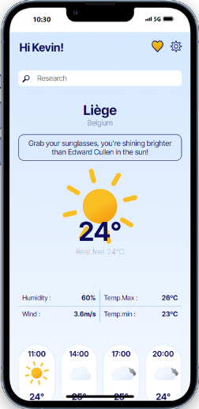

# 🌤️ WildWeather 😎

WildWeather est une application innovante développée dans le cadre du projet 2 de la formation Développeur web full stack à la **WildCodeSchool**. Elle fournit des prévisions météorologiques précises et détaillées, traduites en 9 langues, en utilisant l'API OpenWeatherMap.

## Fonctionnalités

- **Prévisions météorologiques précises** : Recevez des prévisions à jour pour votre localisation.
- **Alertes météorologiques** : Soyez informé des conditions météorologiques extrêmes.
- **Graphiques interactifs** : Visualisez les données météorologiques de manière intuitive.
- **Support multilingue** : Disponible en 9 langues.

## Installation

Pour installer et exécuter WildWeather localement :

1. Clonez le dépôt :

   ```sh
   git clone git@github.com:WildCodeSchool-2024-02/JS-RemoteFR-CodeOfWar-P2-WildWeather.git
   ```

2. Installez les dépendances :

   ```sh
   npm install
   ```

3. Accédez au répertoire du projet:

   ```sh
   cd client/
   ```

4. Démarrez l'application :

   ```sh
   npm run dev
   ```

## Utilisation

   Ouvrez votre navigateur et accédez à `http://localhost:3000`.


## Capture d'écran




## Technologies Utilisées

- React
- CSS
- NodeJS
- API OpenWeatherMap

## Contributeurs

Ce projet a été réalisé par une équipe talentueuse de développeurs :

- [Pierre Cornello](https://github.com/perecornello)  
  
- [Angelo Antonio](https://github.com/geloanto)  
  
- [Ross Alexander](https://github.com/RossAlex0)  
  
- [Monica Tech](https://github.com/monica-tech75)  
  
- [Dampherr](https://github.com/dampherrr)  
  

## Documentation

Une documentation explicative sera dispobible sous peu.
